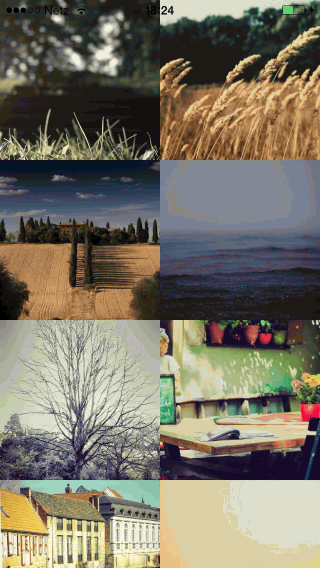

## RCCPeakableImageView

Implementation of a "peekable" thumbnail image as shown 
at the [Flag Kickstarter Project](https://www.kickstarter.com/projects/1306413684/flag-the-app-that-prints-and-mails-your-photos-for)



#### Features

Automatically fills the image view with the image and adjusts "peeking" according to the image size.

Build and run the sample app to see it in action.

#### Usage

```
	// Load image
    UIImage *image = [UIImage imageNamed:@"myImage.jpg"];

    // Setup "peekable" image view
    RCCPeakableImageView *view = [[RCCPeakableImageView alloc] initWithFrame:frame];
    view.image = image;
    
    // Optinally add somme default "peek" 
    // this prevents the image from beeing static
    // even if it fits perfectly inside the view bounds
    view.padding = CGPointMake(20.0f, 20.0f);

```